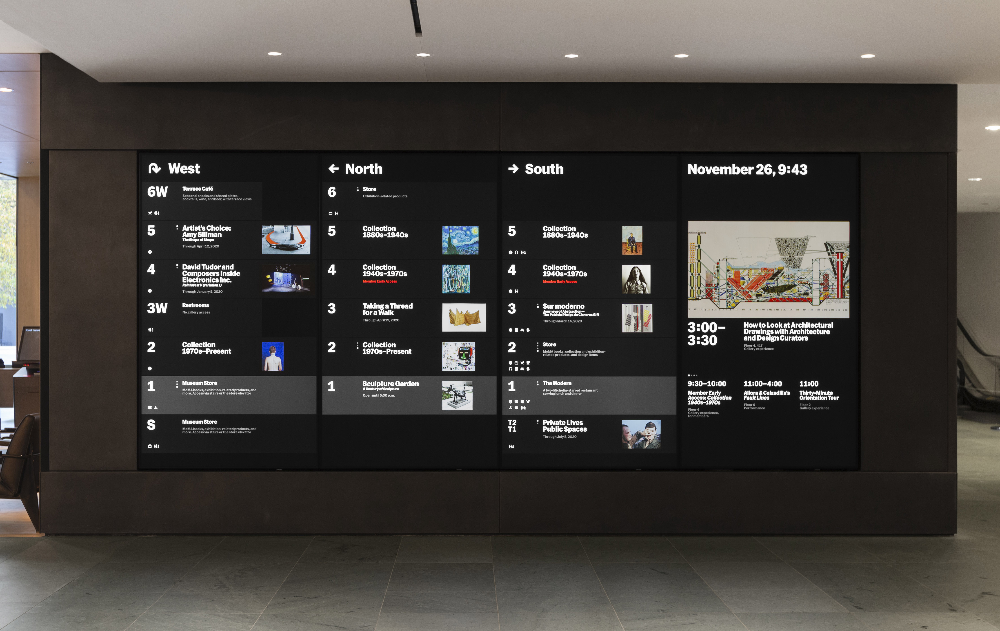

What is *the web*? What is a *web page*?

*If we want to take a step further back, Tuan (Section B’s instructor) shared a [history deck](https://docs.google.com/presentation/d/1LEySqdbmwMVH41aFYtk54VjuyLN9BVUxeSL0QK0hrKE/edit#slide=id.geded19efc4_0_0) with us.*

Obviously, *this* is a web page. Then think about how many other web pages you have visited today. Dozens, even hundreds?

*These are [all](https://moma.org) [web](https://www.moma.org/screens/on_view/west?floor=1&contain=true) [pages](https://www.moma.org/screens/promo/tickets?contain=true).*

If you’re looking at a glowing, 16:9 rectangle somewhere (and it isn’t just playing video), it is very likely a web page—built with the exact same HTML, CSS, and Javascript web technologies that are behind this page and every other.

As the web grew and their capabilities expanded, these technologies have come to dominate for reasons of compatibility, cost, scale, inertia. They are that water we are swimming in.

## These days, apps are often really web pages too

All these desktop “apps” are built in [Electron](https://www.electronjs.org)—and so are really just web pages inside a slim platform-native wrapper. (Essentially, a single-site browser.)

The core application only has to be written once, instead of rewritten for each platform. And why design it all again?

Why hire Windows and Mac devs when you can just hire web devs? …then why hire iOS or Android devs, either?

These mobile “apps” are all built with [React Native](https://reactnative.dev), following a similar paradigm. The app is really just a web view.

## It’s increasingly just Javascript, behind the scenes

Javascript began as a client-side, front-end language running in the browser—but now with environments like [Node](https://nodejs.org/en/), JS has moved to server-side functionality previously dominated by scripting languages like [ASP](https://www.google.com/url?sa=t&rct=j&q=&esrc=s&source=web&cd=&cad=rja&uact=8&ved=2ahUKEwjEtfa8nc31AhUomeAKHd_ABUQQFnoECE8QAQ&url=https%3A%2F%2Fdotnet.microsoft.com%2Fen-us%2Flearn%2Faspnet%2Fwhat-is-aspnet&usg=AOvVaw1D_8ap9ArdBqxmTX1ce1xL), [Perl](https://www.perl.org), [PHP](https://www.php.net), [Ruby](https://www.ruby-lang.org/en/).

This means that Javascript doesn’t just run *in* a webpage you’re looking at—it often now actually *builds* the page itself. More and more, JS isn’t a *part* of the stack so much as it really *is* the stack.

This “javascript everywhere” movement means that the tendrils of the web can encompass many non-web-page uses. Maybe it is in an app, maybe a headless data API, maybe a hardware integration, maybe it is even something entirely *offline—*but it is still web technologies, most of the way down.

## Even things that aren’t web pages are web-page-like

In the coming weeks we are going to dive more properly into HTML, CSS, and JS—the fabric of web pages. Let’s try and also think of these—more conceptually and semantically—as *content*, *form*, and *function*. (Or in another way, *skeleton*, *skin*, and *muscles.*)

With this understanding, the same model exists in nearly all software. (For example, [Resources, Views, States](https://developer.apple.com/tutorials/app-dev-training/#swiftui-essentials) in Mac/iOS development, though the lines are being blurred.) The languages will be different, but the ideas are analogous.

So we can say that software that hasn’t yet been eaten by web technologies is often still web-like. And the web is likely coming for them, eventually.
