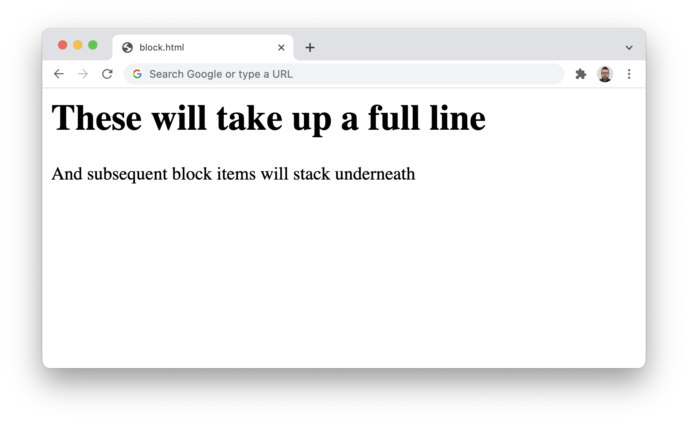
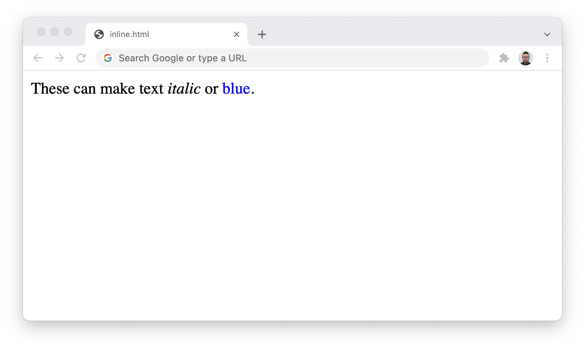
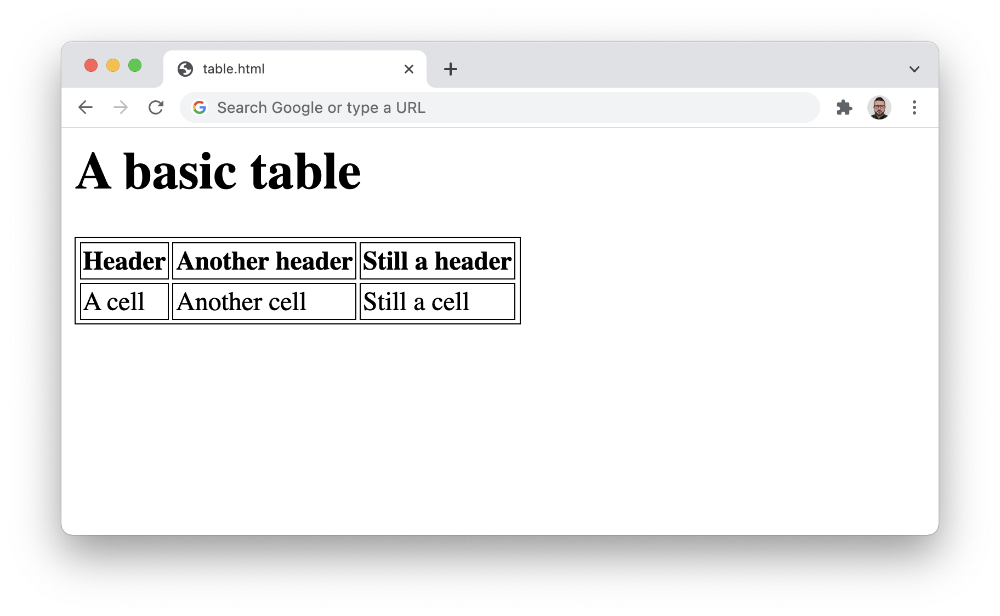
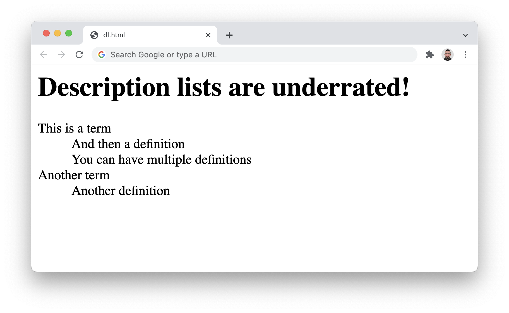
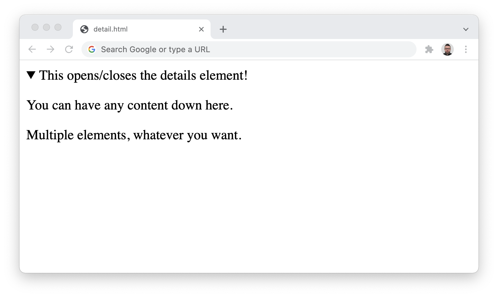

## HTML stands for HyperText Markup Language


HTML is the standard markup language/format for creating web pages, containing the content and structure of a page as a series of tags/elements.
{: .left }

* [HTML | MDN](https://developer.mozilla.org/en-US/docs/Web/HTML) \
  *When in doubt, refer to the MDN documentation!*

* [Basics of HTML](https://www.youtube.com/watch?v=CkzbI1Tv_rQ)\
  *A very calming introduction by Laurel Schwulst.*
{: .icon-link .no-marker .right rows="2"}

In our ongoing analogy, HTML is the *skeleton* of the web. At its most basic it is a text file, in a folder on a computer, with a `.html` extension.
{: .left }

As we heard last week, this format was codified by our pal [Tim Berners-Lee](https://www.w3.org/People/Berners-Lee/) in 1991, evolving from his earlier [SGML](https://en.wikipedia.org/wiki/Standard_Generalized_Markup_Language), a similar/proto language. There have been five major revisions to the spec since then, which added (and sometimes *deprecated*, or removed) tags and syntax:
{: .left }

- HTML 1, 1991
- HTML 2, 1995
- HTML 3, 1997
- HTML 4, 1997 (busy year)
- HTML 5, 2014


## The basic document


HTML consists of a [range of elements](https://developer.mozilla.org/en-US/docs/Web/HTML/Element), nested inside one another, like a [matryoshka doll](https://en.wikipedia.org/wiki/Matryoshka_doll) of text.


*As a visual:*
{: .two-above }


*As code:*
{: .two-above }

```html
<!DOCTYPE html>
<html>
	<head>
		<title>Page title</title>
	</head>
	<body>
		<h1>This is a heading</h1>
		<p>This is a paragraph.</p>
		<p>This is another paragraph.</p>
	</body>
</html>
```

The `<html>` element contains all elements of the page, the `<head>` element contains the title, and the body contains `<h1>` and `<p>`.

We call these [*semantic* elements](https://www.w3schools.com/html/html5_semantic_elements.asp)—which is saying that they give their contents a *meaning* or a *role*. (Remember [Tim’s diagram](topic/everything/web.png).) These *roles* are then interpreted by your browser (Chrome, Safari, Firefox, etc.) when it loads the file, to ultimately display the page. We call this *parsing* the document.


*From the example above, here is what we’ve told the browser:*
{: .four-above }

- `<!DOCTYPE html>` \
  What kind of file this is, so it knows how to parse.

  - `<html>` \
    The root element of an HTML page, containing all the content.

  - `<head>` \
    The *meta* information about the HTML page—like its title, default language, [scripts](https://developer.mozilla.org/en-US/docs/Web/HTML/Element/script), and [stylesheets](https://developer.mozilla.org/en-US/docs/Web/HTML/Element/style). \
    \
    *Nothing in this element is visible on the page itself.*

    - `<title>` \
      Specifies a [title](https://developer.mozilla.org/en-US/docs/Web/HTML/Element/title) for the page—which is shown in the browser’s tab, and when it is shared.

  - `<body>` \
    Defines the document's body—the container for all the visible contents, such as headings, paragraphs, images, hyperlinks, tables, lists, etc.

    - `<h1>` \
      Defines a primary/first-level heading.

    - `<p>` \
      Defines a paragraph.


## What are elements?


[Elements](https://developer.mozilla.org/en-US/docs/Glossary/Element) are composed of tags (opening, closing) and their content:

.png)

Some elements do not have any content or children, like `<br>` or ``. These are called [*empty elements*](https://developer.mozilla.org/en-US/docs/Glossary/Empty_element) and do not have a closing tag.
{: .four-below }


### `<h1>` `<h2>` `<h3>` `<h4>` `<h5>` `<h6>` for headings

```html
<h1>There should only be one first-level heading!</h1>
```


### `<p>` for paragraphs

```html
<p>You should always wrap your text in a paragraph!</p>
```


### `<a>` are links

The `href` (*H*ypertext *REF*erence) specifies a URL that the link points to, and the tag wraps the visible link text. The `href` can point to another, local HTML file (living in the same directory structure) or an external page. They can also point to specific parts of a page.

```html
<a href="https://www.example.com">Links need attributes! I’ll explain.</a>
```


### `` are images

The `src` likewise can point to a local image file or an external URL! `alt` provides a description for accessibility/screen readers.

```html

```


### `<header>` `<footer>` `<nav>` `<main>` `<article>` `<section>` `<div>` define areas

These are the structural containers of a website. The names don’t imbue meaning or function directly, but help us organize and think about our content structure.


### `<span>` `<strong>` `<em>` wrap around bits of text

### `ol` `ul`, and `li` build lists

There are [many, many HTML elements](https://developer.mozilla.org/en-US/docs/Web/HTML/Element), all with particular uses. We’ll unpack some more, below.


## Attributes


All HTML elements can have attributes, which provide more information about the element:


*Some common attributes:*
{: .two-above }

- The `lang` attribute of the `<html>` tag declares the language of the Web page.

- The `href` attribute of `<a>` specifies the URL of the page the link goes to.

- The `target` attribute `_blank` can tell a `<a>` to open in a new window/tab.

- The `style` attribute is used to add styles to an element, such as color, font, size, etc.

- The `src` attribute of `` specifies the path to the image to be displayed.

- The `width` and `height` attributes of `` provide size information for images.

- The `alt` attribute of `` provides an alternate text for an image.

- The `id` specifies a singular, unique element on a page, for CSS targeting and anchor (scroll, “jump”) links.

- The `class` attribute provides a selector took hook on with CSS.


## Case, whitespace, tabs, line breaks


HTML doesn’t care about capitalization, extra white space, or line breaks. The browser will just read everything from left to right, as if it is one long, running sentence. So the shouty `<!DOCTYPE HTML>` and quieter `<!doctype html>` are interpreted the same.

The browser parses both of these in the exact same way:
{: .two-above }

```html
<body>
	<h1>Dog Breeds</h1>
	<p>There are many kind of dog breeds</p>
	<ul>
		<li>German Shepherd</li>
		<li>Bulldog</li>
		<li>Poodle</li>
	</ul>
</body>
```

```html
<body><h1>Dog Breeds</h1><p>There are many kind of
dog breeds</p><ul><li>German Shepherd</li>
<li>Bulldog</li><li>Poodle</li></ul></body>
```

But obviously, the first one is much more readable to us humans. We can use whitespace, tabs/indenting, and line breaks to make it easier for us to read the code. There are a lot of common patterns used—like indenting to indicate hierarchy/nesting. But there are also no wrong ways to do it! In HTML, spaces are code *ergonomics* for you—just like a good chair or desk, that allow you to work more comfortably.


## Block elements


[Block-level elements](https://developer.mozilla.org/en-US/docs/Web/HTML/Block-level_elements) always start on a new line, and take up the full width available—stretching out to the left and right of their parent/container. They stack on top of each other. Importantly, block elements can have a top and bottom margin, unlike inline elements:

`<address>`
`<article>`
`<aside>`
`<blockquote>`
`<canvas>`
`<dd>`
`<div>`
`<dl>`
`<dt>`
`<fieldset>`
`<figcaption>`
`<figure>`
`<footer>`
`<form>`
`<h1>`-`<h6>`
`<header>`
`<hr>`
`<li>`
`<main>`
`<nav>`
`<noscript>`
`<ol>`
`<p>`
`<pre>`
`<section>`
`<table>`
`<tfoot>`
`<ul>`


```html
<h1>These will take up a full line</h1>
<p>And subsequent block items will stack underneath</p>
```




## Inline elements


[Inline elements](https://developer.mozilla.org/en-US/docs/Web/HTML/Inline_elements) do *not* start on a new line, and only take up as much width as necessary. I like to think of these as the little metal slugs [from printing](https://en.wikipedia.org/wiki/Slug_(typesetting)). Other text and inline elements will continue to flow around them, and they can wrap to new lines:


`<a>`
`<span>`
`<strong>`
`<em>`
``


```html
<p>
	These can make text <em>italic</em> or <span style="color:blue;">blue</span>.
</p>
```




## So many elements!


### Comments

You can *comment* part of the code and the browser won’t show it. Comments are often used to explain your thinking, organize your code, “turn off” a bit of code, or hide whatever you’d like.

```html
<p>Sometimes you want to note something while coding.</p>
<!-- This text will not be shown in the browser! -->
<p>You can write these notes in comments.</p>
```

I highly recommend getting into a habit of commenting your code, especially when starting out. If you figure something tricky out, write down why and how you solved it to help you understand and remember. And you’ll often come back to things. Commenting your code is a gift to your future self!


### Tables

```html
<h1>A basic table</h1>
<table>
	<thead>
		<tr>
			<th>Header</th>
			<th>Another header</th>
			<th>Still a header</th>
		</tr>
	</thead>
	<tbody>
		<tr>
			<td>A cell</td>
			<td>Another cell</td>
			<td>Still a cell</td>
		</tr>
	</tbody>
</table>

<!-- To understand the example better, we have added borders to the table. -->
<style>table, th, td { border:1px solid black; }</style>
```

These aren’t used as often anymore, in favor of `<div>` and other layout elements. You used to [have to use them](https://thehistoryoftheweb.com/tables-layout-absurd/) to get any kind of multi-column, grid layouts. But those need even more CSS!




### Lists

Any time you have more than two of something, you probably have a list. These are commonly used for semantic navigation elements, as well, think *“here’s a list of links in this site*.

```html
<h2>You can have an ordered list</h2>
<ol>
	<li>First item</li>
	<li>Second item</li>
	<li>Third item</li>
</ol>

<h2>Or an unordered one</h2>
<ul>
	<li>An item</li>
	<li>Another item</li>
	<li>Another item</li>
</ul>
```


### Description lists

```html
<h1>Description lists are underrated!</h1>
<dl>
	<dt>This is a term</dt>
	<dd>And then a definition</dd>
	<dd>You can have multiple definitions</dd>
	<dt>Another term</dt>
	<dd>Another definition</dd>
</dl>
```



These aren’t much to look at without CSS, though. Soon!


### Details

There is even some basic interactivity (way, way ahead of JavaScript) with `<details>` and `<summary>` blocks, which open and close.

```html
<details>
	<summary>This opens/closes the details element!</summary>
	<p>You can have any content down here.<p>
	<p>Multiple elements, whatever you want.<p>
</details>
```



Again, there are [many, many, many, many HTML elements](https://developer.mozilla.org/en-US/docs/Web/HTML/Element). Try and find the one that best fits your usage, wherever possible using one that matches your semantic use.


## …and favicons

This isn’t… strictly HTML, but we’ll talk about them now—these are the little icons you see in browsers tabs. No page is complete without them!

You can use any image you like as your favicon, and they are generally rendered on tabs at 16×16 points. (So you need a 32×32 pixel image, for most recent Macs with [retina/@2x screens](https://www.danrodney.com/blog/retina-web-graphics-explained-1x-versus-2x-low-res-versus-hi-res/).)

To add a favicon to your page, you can either save a `favicon.ico` to the *root* (base) directory of your site—or specify the icon explicitly in your page, with a `<link>` element to your `<head>`:

```html
<!DOCTYPE html>
<html>
	<head>
		<title>Page title</title>
		<link href="favicon.png" rel="icon">
	</head>
	<body>
		<h1>This is a heading</h1>
		<p>This is a paragraph.</p>
		<p>This is another paragraph.</p>
	</body>
</html>
```

When you add them in this way, you can use common image formats like `.png` or `.svg`.
