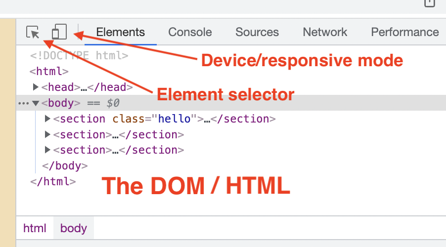
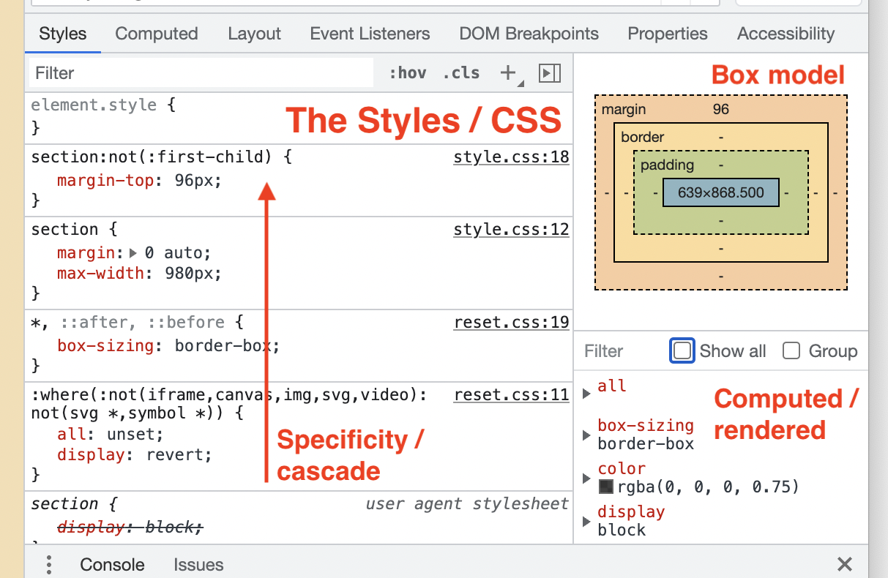
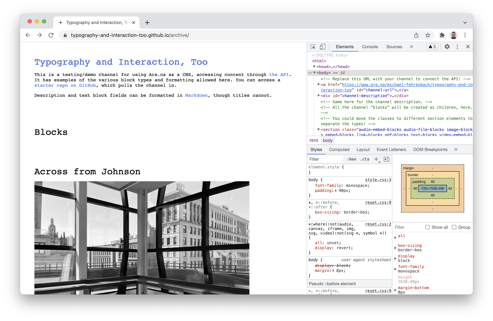
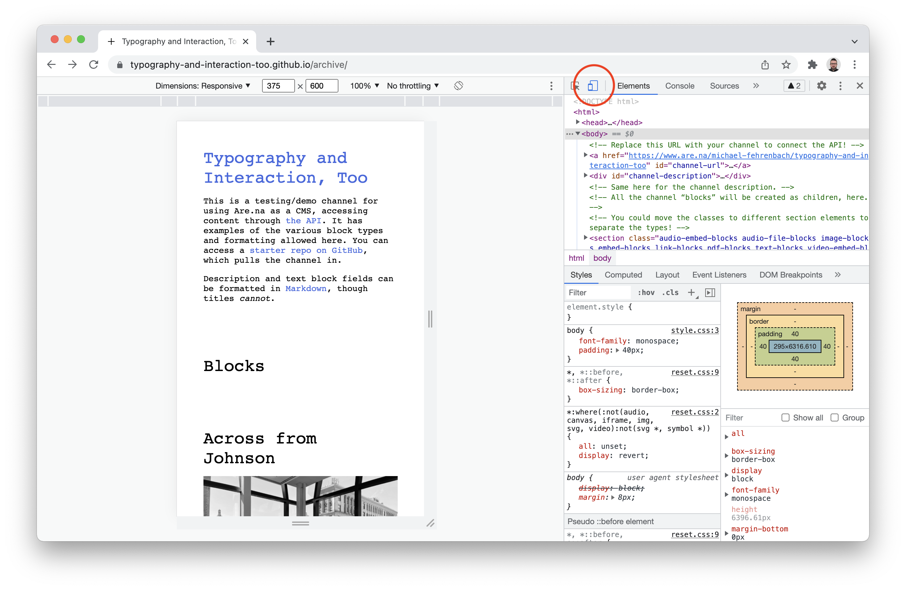
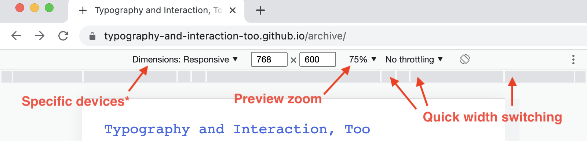
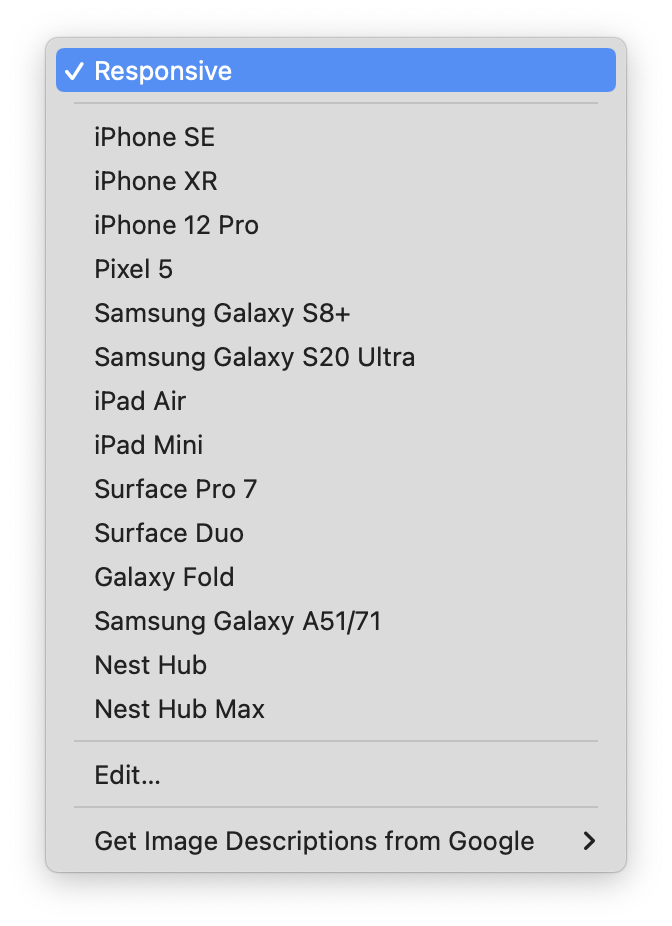

> When working locally, you’ll also want to install the [Live Server](https://marketplace.visualstudio.com/items?itemName=ritwickdey.LiveServer) plugin, for quick/auto reloading in the browser! If you prefer this within the VS Code/IDE window, you can use [Live Preview](https://marketplace.visualstudio.com/items?itemName=ms-vscode.live-server), instead.
{: .callout icon='🔌' }

I am definitely a “Safari guy” for my daily driver browser. But for dev work, [Chrome](https://www.google.com/chrome) is the best in town. (They are all kind of differently bad, in different ways.)
{: .left }

[Chrome DevTools](https://developer.chrome.com/docs/devtools/) \
*We’ll be using Chrome’s developer tools.*
{: .icon-link .right }

Chrome has the most robust, best-in-class set of *DevTools*—though [Safari](https://developer.apple.com/safari/tools/) and [Firefox](https://developer.mozilla.org/en-US/docs/Tools) have their own versions, too. You’ll often hear people (me) call it the “Web Inspector” or just “The Inspector”. It’s going to be your best (Web) friend, showing you everything that the browser has *parsed* to display the page.
{: .left }



*In Chrome, you can bring them up by right-clicking on any element/part of a page and clicking <em>Inspect</em>.*
{: .two-above }

*You can also hit `⌘-⌥-I`, on the Mac.*

You’ll see the tools on the right side of the page. Depending on how big your screen is, they might be laid out a bit differently—but the basics are the same:
{: .four-above }





## Elements panel

The top part is the DOM—you can expand/collapse all the nested HTML *elements* on the opened page.

The first button in the upper-left lets you mouse over on the page, and will then show you that element hierarchically in the DOM.

The second (more on this later, toggles the *Device toolbar*, “responsive mode.”

*Handy tip here:* **`⌘ F`** *in here will let you search for elements or text by name.*

The middle part is for the styles. It shows whatever *CSS properties* apply to the element you have selected above, in *the DOM*.

These are ordered with the most-specific at the top, with cascading/conflicting rules crossed out lower.

On the right, you can see the sum *Computed* values of all the rules that apply.

Below this is the *Console*, which is for debugging Javascript. We’ll talk more about this later.

### **You can make changes in the *DOM* or *Styles* areas, and the changes will be immediately visible on the page.

But they are temporary—these changes will be lost when you leave or reload the page! They are just for you.**

# Device mode!

First open the inspector, as [noted above](https://www.notion.so/DevTools-The-Inspector-d0533c0133b24b168160eee046ce94b9).

Enter the *device mode* with the little phone/tablet icon.

These device dimensions don’t have accurate heights.

You can select specific device dimensions—but these aren’t always useful! They don’t account for the web browser’s own interface, so they are usually much too tall.

Instead, use the *Responsive* mode that lets you type in specific pixel dimensions. Or you can use the divided bar underneath to quickly jump through common widths. (Be sure to *refresh* with `⌘-R` if the page doesn’t rescale.) And remember that we aren’t targeting devices—we are looking for when our content *breaks*.

You can also use the *zoom* dropdown to approximate views *larger* than your current screen! This is great for developing on a laptop.

### **But always be sure check on the real thing! This is just a quicker preview, but isn’t always perfectly accurate.**

<!-- ## Testing responsive design

The easiest way to test all these things out is using [the device mode](https://www.notion.so/DevTools-The-Inspector-d0533c0133b24b168160eee046ce94b9) in Chrome’s *Inspector*. There will still be differences (like not necessarily honoring device-specific settings like `hover`), but for layout/breakpoint development it is often much faster than checking on actual devices!

[*DevTools / The Inspector*](https://www.notion.so/DevTools-The-Inspector-d0533c0133b24b168160eee046ce94b9) -->
